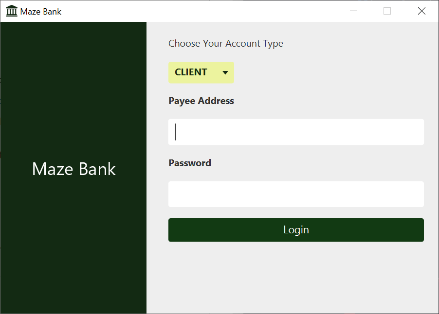

<div align="right">
  
  </a>
</div>

# Udemy Project: JavaFX Master Class: Create A Banking Application - 2022
This is a hands-on project from the Udemy course - JavaFX. Created a banking App by Patrick T.


# Demo

<div align="center">
  
  
</div>

You can run the demo on your local machine, please follow the instructions in [Getting Started](#getting-started).

# Technologies

- [JAVA](https://reactjs.org/)
- [JavaFX](https://openjfx.io/)
- [CSS](https://web.dev/learn/css/)
- [SQLite](https://www.sqlite.org/index.html)


# Getting Started

Follow the instructions below to set up the environment and run this project on your local machine.

1. Clone this repository.

```bash
# Clone repository
$ git clone https://github.com/ViniUK00/maze-bank.git
```

2. Install dependencies 

```bash
$ Make sure you have javaFx setup in your IDE.
$ JDK 14.0 or later
```

3. Run the server.

```bash
 $ Open the main package and run Main.java class *enjoy !*.
```
